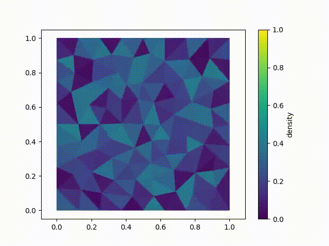

[](https://github.com/TheoRGirard/hughes2d/actions/workflows/python-package.yml)
[](https://hughes2d.readthedocs.io/en/latest/index.html)


# hughes2d
A numerical scheme to approximate the solutions of the Hughes model using a finite volume scheme for the scalar conservation law and a fast marching algorithm for the Eikonal equation.

Documentation: https://hughes2d.readthedocs.io/en/latest/index.html

## Installation
The hughes2d package dependencies are managed using **uv** (see [uv](https://docs.astral.sh/uv/)). If uv is installed, you can install the **hughes2d** package and its dependencies by typing:
```
git clone https://github.com/TheoRGirard/hughes2d |
cd hughes2d |
uv sync
```
### Plots
If you want to use plot functionnalities you should also add *matplotlib* or *plotly*:
```
uv add matplotlib
```
or install the extras:
```
uv sync --extra plot
```
### File format handling
If you want to import *.dxf*, *.msh* or *FreeFEM* mesh files, you should include the file-format extra:
```
uv sync --extra file-formats
```
You can also include all the extras:
```
uv sync --all-extras
```

### Without uv
If you don't have uv installed, you can see a list of the dependencies in the _pyproject.toml_ file.

You can either install the dependencies with pip:
```
git clone https://github.com/TheoRGirard/hughes2d |
cd hughes2d |
pip install -r requirements.txt |
pip install -e
```

or install the dependencies manually.

## Getting started
You can find a file named _getting_started.py_ in /examples. We rewrite below the content of this file.
```
from hughes2d import *

#Construction of the domain--------------------------------
MyDomain = Mesh2D.NonConvexDomain([[0,0],[0,1],[1,1],[1,0]])
MyDomain.addExits([[[1,0],[1,1]]])
MyDomain.show()

#Construction of the mesh--------------------------------------
MyMesh = Mesh2D.Mesh()
MyMesh.generateMeshFromDomain(MyDomain, 0.01)
MyMesh.show()
MyMesh.saveToJson("gettingStartedSimu")


#Construction of a random initial datum---------------------------------------
MyMap = Mesh2D.CellValueMap(MyMesh)
MyMap.generateRandom()
MyMap.show()

#Setting the options for the simulation-----------------------------------------
opt = dict(model = "hughes",
            filename = "gettingStartedSimu",
            save = True,
            verbose = True
            )

#Creating the solver and computing---------------------------------------------------
Solver = Splitting.PedestrianSolver(MyMesh, 0.01, initialDensity = MyMap, options=opt)
Solver.computeUntilEmpty(100)

#Converting the data to a mp4 video------------------------------------------
Plotter.convertToMP4("gettingStartedSimu", limits=[[0,1],[0,1]])
```
Compiling and running this code should create 3 .csv files, 1 .json file and 1 .mp4 file. The .mp4 file should look like the video below:




## The **opt** dictionary

We detail here the different options available in the **opt** dictionary passed as a parameter to the **PedestrianSolver** object:
```
{
  model = "hughes", #(string) switch between different models among { "hughes", "colombo-garavello" , "constantDirectionField" }
  filename = "data/HughesRuGrandmont", #(string) filename serving as a basename for the saved files
  save = True, #(boolean) saving or not the computed data
  verbose = True, #(boolean) printing messages in the console
  lwrSolver = {   convexFlux = True, #(boolean) if the flux function is convex, setting this to true switch from dichotomy to explicit computations
                  anNum = "dichotomy", #(string) chose the method of computation if not explicit between : dichotomy, Newton (not available for the moment...)
                  method = "midVector", #(string) method of resolution of the edge discontinuous flux : between 'tmap' (transmission maps) and 'midVector' (continuous godunov scheme with an averaged vector between the two triangles)
                  ApproximationThreshold = 0.0001}, #(float) the approximation threshold for the computed values
  eikoSolver = {  'constrained' : True, #(boolean) if set to True, the considered gradient for the Fast marching algorythm must stay inside the triangle from which it is computed.
                  'NarrowBandDepth' : 2} #(int) thickness (in number of neighbouring degree) of the narrow band.
}
```
