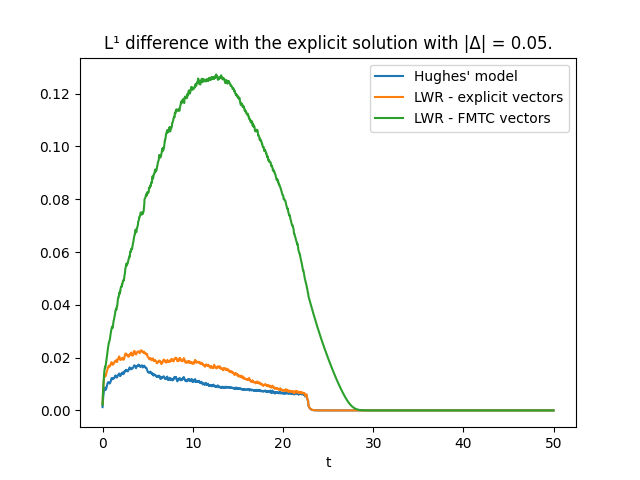
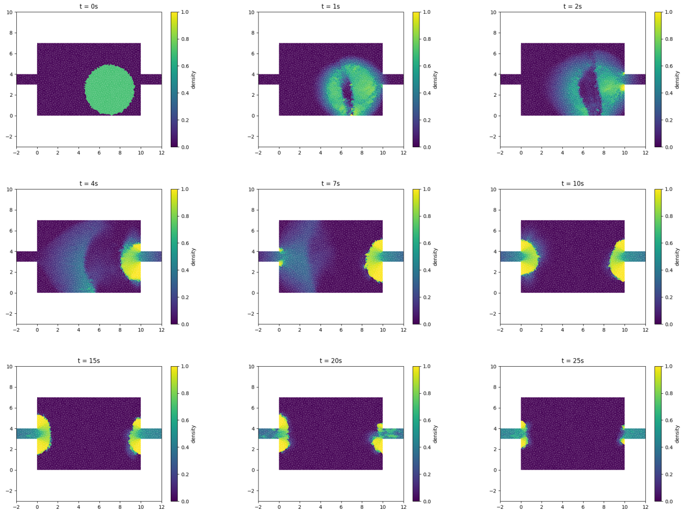

# Summary

`hughes2d` is an open-source python package for simulation pedestrian crowds in two dimensions. More specifically, the package is designed to compute approximations of Hughes' model introduced in [@Hug02] (and other related models). The Hughes model is a macroscopic model -there is no agents here, the crowd is represented by a density function- coupling two non-linear partial differential equations.

# Statement of need

The mathematical modeling of pedestrian crowd is a rapidly developping topic since a few decades. There exist multiple software for simulation crowds of pedestrians both open source ([vadere],[JuPedSim],[UMANS],[Cromosim]) or not. However, up to our knowledge, all these softwares deal with microscopic simulations. We propose here a python package for macroscopic simulations of pedestrian evacuations, specifically for Hughes' model which is one of the most famous macroscopic pedestrian flow models.

The Hughes model has been thoroughly studied during the last two decades (see [@survey]) but there exists, at the moment, no general mathematical result of existence of solutions in 2D for this model. Some simulations appear in a few papers (see [@Goatin]) but in a slightly modified context. The present package should provide a reliable and open-source solution to approximate the behavior of Hughes' model.
We also hope that this package will help formulating conjectures in the future.

## Introduction to Hughes' model

The model consists in a system of two equations set on a bounded domain $\Omega \subset \mathbb{R}^2$. The first PDE is a vector-directed **scalar conservation law** with discontinuous flux. The second is an **Eikonal equation** with discontinuous source term.

### The scalar conservation law

The first equation models the flow of a density $\rho$. To be more precise  $\rho(t,x)$ represents the density of pedestrian at time $t$ and location $x$. It is bounded between $0$ and a given $\rho_{max} >0$. We assume that the pedestrian move with the speed of agents $v(t,x)$ at time $t$ and location $x$ following a unitary direction field $\vec{V}(t,x) \in \mathcal{S}_1$.
Then, if we write the conservation of the mass on pedestrian on each subdomain of $\Omega$, we end up with the following scalar conservation law:

$$ \partial_t \rho + \mathbf{div}(\vec{V}(t,x) v(t,x) \rho(t,x)) = 0.$$

In Hughes' model, we assume that the speed of agents $v(t,x)$ at time $t$ and location $x$ only depends on the density $\rho(t,x)$ and that this speed is decreasing with respect to the density.
Then, in the following we will denote the speed by $v(\rho(t,x))$ where $v$ is a decreasing function defined on $[0,\rho_{max}]$ such that

$$ v(0)=: v_{\max} \textrm{ and } v(\rho_{max})= 0.$$

A classical example of such a speed function is $v(\rho) = v_{max}\frac{\rho_{max}-\rho}{\rho_{max}}$. This corresponds to the very classical Lighthill-Whitham-Richards (LWR) model for traffic flows (see [@LW55], [@Ric56]).

### The Eikonal equation

The second equation of the model characterizes the unitary direction field $\vec{V}(t,x)$ depending on the density $\rho$ in the whole domain. We assume that the pedestrians want to minimize their exit time while also trying to avoid high density regions. In order to model this situation, we use an optimal control problem. We suppose that the density $\rho(\cdot) \in \mathcal{C}^1(\bar \Omega)$ stays constant in time (this assumption is quite controversial).
Let $x \in \Omega$. For any $\alpha(\cdot) \in \mathcal{C}^1((0,+\infty),\mathcal{S}_1)$, we say that $X^\alpha_x(\cdot)$ is a trajectory controlled by $\alpha$ starting at $x$ if $X$ is a solution to the Cauchy problem:

$$
 \left\lbrace \begin{matrix}
 \dot{X}^\alpha_x(s) = \alpha(s)v(\rho(t,X^\alpha_x(s))) \\
 X^\alpha_x(0) = x
 \end{matrix}\right.
 $$

For any $x \in \Omega$, we denote by $\mathcal{A}_x = \lbrace X^\alpha_x, \alpha \in \mathcal{C}^1((0,+\infty),\mathcal{S}_1) \rbrace$ the set of all controlled trajectories starting at $x$. We define $\phi(x)$ as the minimal exit time starting at location $x$, that is to say:

$$ \phi(x) = \inf_{X \in \mathcal{A}_x} \int_0^{+\infty} \mathbb{1}_{\Omega}(X(t)) \textrm{d} t.$$

In Hughes' model, we also take into account the discomfort caused by being surrounded by a high density crowd. In order to model this discomfort, we introduce an increasing function $g(\rho)$ with respect to the density $\rho$. The function $g(\rho)$ can be interpreted as a running cost we are paying along a trajectory $X$ for being in high density regions. Then, the previous equation becomes:

$$ \phi(x) = \inf_{X \in \mathcal{A}_x} \int_0^{+\infty} \mathbb{1}_{\Omega}(X(t))g(\rho(X(t))) \textrm{d} t.$$

A very classical result of the theory of viscosity solution for Hamilton-Jacobi-Bellman (HJB) equations is that
solving the optimal control problem above is in fact equivalent to solving the Eikonal equation:

$$
 \left\lbrace \begin{matrix}
 |\nabla \phi (x) | = \frac{g(\rho(x))}{v(\rho(x))} && x \in \Omega\\
 \phi(x) = 0 && x \in \partial\Omega
 \end{matrix}\right.
 $$

We now claim that the direction field $\vec{V}(t,x)$ should be the unitary descending gradient of $\phi$.
If we suppose that there exists $X^\star_x$ an optimal trajectory,
i.e. $\phi(x) = \int_0^{+\infty} \mathbb{1}_\Omega(X^\star_x(t))g(\rho(X^\star_x(t)))\textrm{d} t$, then we have

$$ \vec{V}(t,x) = \dot{X}^\star_x(0) = -\frac{\nabla \phi(x)}{|\nabla \phi(x)|}.$$

### The Hughes model definition

Then the complete Hughes' model introduced in [@Hug02] was the following:

$$
 \left\lbrace \begin{matrix}
 \partial_t \rho + \mathbf{div}(\vec{V}(t,x) v(t,x) \rho(t,x)) = 0 \\
 \vec{V}(t,x) = -\frac{\nabla \phi}{|\nabla \phi|} \\
 |\nabla \phi (t,x) | = \frac{g(\rho(t,x))}{v(\rho(t,x))} && x \in \Omega\\
 \phi(t,x) = 0 && x \in \partial\Omega.
 \end{matrix}\right.
$$

>[!NOTE]
 Here, we chose to present the Hughes' model without any wall around or inside the domain for consiness' sake. Keep in mind that for a domain with walls and exits, both equations should be solved with mixed boundary condition i.e. Neumann non-crossing conditions on the walls and Dirichlet free-exit boundary conditions on the exits.

For a deep overview of the mathematical results regarding Hughes' model we defer to [@survey].

## Model of Colombo-Garavello-Lécureux-Mercier

In [@CGLM11], the authors introduced an alternative model for pedestrian flows.

In this model, the agents chose the shortest path to the exits without taking the density into account. This corresponds to the Eikonal equation with constant source term:

$$
 |\nabla u (x)| = 1.$$

Then the vector field prescribing the direction of the agents $\vec{V}(x)$ is a combination between the direction of the shortest path $\frac{-\nabla u}{|\nabla u|}$ and a non-local deviation operator $\mathcal{I}[\rho](x)$.
In [CGLM11]_, the authors propose the a definition for the non-local operator: let $\eta_r(\cdot)$ be a mollifier compactly supported in the ball of radius $r > 0$; then we define:

$$ \mathcal{I}[\rho](x) = - \epsilon \frac{\nabla \rho * \eta_r}{\sqrt{1+|\nabla \rho * \eta_r|^2}}.$$

> [!NOTE]
> The operator above depends on two real parameters: the radius r and the amount of deviation epsilon. These parameters corresponds to the parameters of the dictionary $$CGparameters$$ in the python package.

In the present package, we denote by the Colombo-Garavello-Lecureux-Mercier model the following (slightly modified) system:

$$\left\lbrace \begin{matrix}
 \partial_t \rho + \mathbf{div}(\vec{V}(t,x) v(t,x) \rho(t,x)) = 0 \\
 |\nabla \phi (t,x) | = 1 \\
 \vec{\nu}(x) = - \frac{\nabla \phi}{|\nabla \phi|} \\
 \mathcal{I}[\rho](x) = - \epsilon \frac{\nabla \rho * \eta_r}{\sqrt{1+|\nabla \rho * \eta_r|^2}}\\
 \vec{V}(t,x) = \frac{ \vec{\nu}(x) + \mathcal{I}[\rho](x) }{| \vec{\nu}(x) + \mathcal{I}[\rho](x) |}
 \end{matrix}\right.$$

This model is also featured in the present python package.

> [!NOTE]
> We defer to the introduction of Section 4.5.1 of [@Gir25] for the presentation of the numerical schemes used in the present package.

# Estimation of convergence

We consider Hughes' model in the specific context where the 2D dynamics is reduced to the 1D dynamics towards the unique exit:

- $(\Omega, \mathcal{E},\mathcal{W})$ is defined by \eqref{eq:domainCouloir};
- $\rho_0$ is defined by \eqref{eq:rho0couloir};
- the cost function $c$ is defined by $c(\rho) := 1 + \rho$.

We define the couple $(\rho,\phi)$ where $\rho$ is defined by
$$
\rho(t,x) := \left\lbrace \begin{matrix}
0 &\textrm{ if } x \leq 0.3t \textrm{ and } t \leq 5/0.3\\
0 &\textrm{ if } x \leq  5 + t - 2 \sqrt{5\times0.7t} \textrm{ and } t> 5/0.3\\
\min \left( 0.7, \max \left( 0, \frac{1}{2} + \frac{5-x}{2t} \right) \right) & \textrm{ else,}
\end{matrix}\right.
$$
and $\phi$ is defined by:
$$
\phi(t,(x,y)) := \int_x^{10} 1 + \rho_*(t,(z,y)) \d z.
$$
Then notice that $(\rho,\xi)$ is well defined and is an explicit solution to Hughes model.
Notice also that, for any $(t,z) \in [0,T]\times \bar\Omega$, we have:
$$V(t,x) = \left( \begin{matrix} 1 \\ 0 \end{matrix} \right).$$

Then we compute the normalized $L^1$ difference $\mathbf{Diff}_{L^1}$ between the explicit density $\rho$ of the solution $(\rho,\phi)$ and the numerical density obtained using **Hughes2d** approximation scheme.
As a comparison, we also compute the normalized $L^1$ difference $\mathbf{Diff}_{L^1}$ between the explicit density $\rho$ and
- the numerical approximation to the scalar conservation law with the explicit vector vector field $V = (1,0)$;
- the numerical approximation to the scalar conservation law with the gradient of the $\mathbf{FMTC}$ approximation of the solution to the eikonal equation when $c = 1$.

)

It is interesting to notice that the **Hughes2d** approximation scheme gives a better approximation than the finite volume scheme computed with the explicit vector field $V = (1,0)$. We believe that this phenomenon (which can seem quite contradictory) occurs because, in the **Hughes2d** approximation scheme, the specific coupling of the finite volume scheme with $\mathbf{FMTC}$ tends to compensate for the numerical errors produced by the finite volume scheme alone. This specific coupling seems to induce a regularization of the density in the vertical direction $(0,1)$ (see [@Gir25] for a more detailled study of this conjecture).

# Examples

We present a simple simulation of Hughes' model in a room with exits located at the end of two corridors. More precisely, we use the setting:
$$
    \bar\Omega := [-2,0]\times [3,4] \cup [0,10]\times [0,7] \cup [10,12] \times [3,4],
    $$
    $$
    \mathcal{E} := \lbrace -2\rbrace \times [3,4] \cup \lbrace 12\rbrace \times [3,4],
    $$
    $$
  \mathcal{W} := \partial \Omega \setminus \mathcal{E},
  $$
  $$
    \rho_0(x) := 0.7\times \mathbb{1}_{B((7,2.5),2.4)},
    $$
    $$
    c(\rho) = 1 +5\rho.
$$
 We also mention that many videos corresponding to various numerical experiments (including this one) are available at [https://theorgirard.github.io/simulations](https://theorgirard.github.io/simulations).

In this simulation, we can observe the following distinctive features of Hughes' model.

- **Repartition of the agents between the different exits.** Notice that after the time $t=10s$ the agents seem to be separated in two different groups, one for each exit. The repartition of agents was already featured in the one-dimensional Hughes' model (see [@survey],[@Gir25]). As in the 1D case, we can observe the "overtaking of the turning curve" phenomenon. More precisely, we can see that some agents that were moving towards the left before a given point in time $t=\tau$ and move towards the right for $t > \tau$ (see for example at time $t=4s$). In the 1D case, this phenomenon corresponds to the $\xi(t)$ turning curve crossing a region in space where $\rho(t,\xi(t)) \neq 0$.

- **Geometry of the congestion figures.** Notice that after $t=15s$ the density profiles don't seem to evolve much. The room evacuates at a slow pace and the density profile for different times "look alike" until the end of the evacuation. In [@Gir25], we try to give a more rigorous definition of this phenomenon and measure the influence of the initial datum on the large time density profiles.
- **Regularization of the density in time.** Starting at $t=1s$, we can observe that the density seems to be continuous on the boundary of the support of the initial datum. In fact, it seems that, apart from the shocks that appeared in the interior of the $B((7,2.5),2.4)$, the density is continuous in space. We conjecture that the specific coupling of the scalar conservation law with the eikonal equation induces a kind of regularity of the density that is not to be expected of solution to the scalar conservation law for an abritrary vector field $V$.

# Acknowledgements

# References
